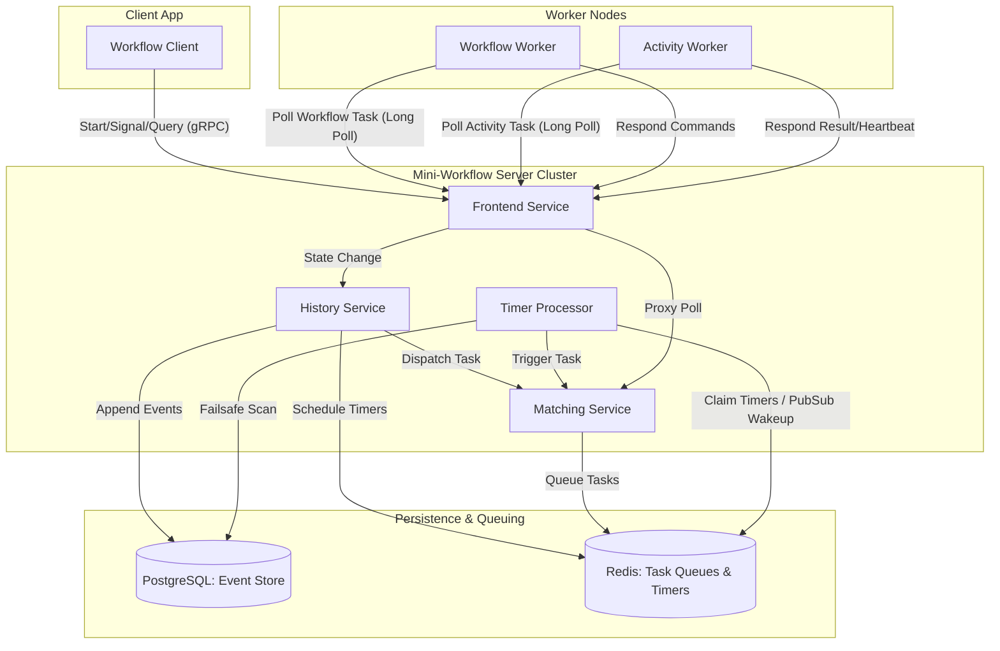
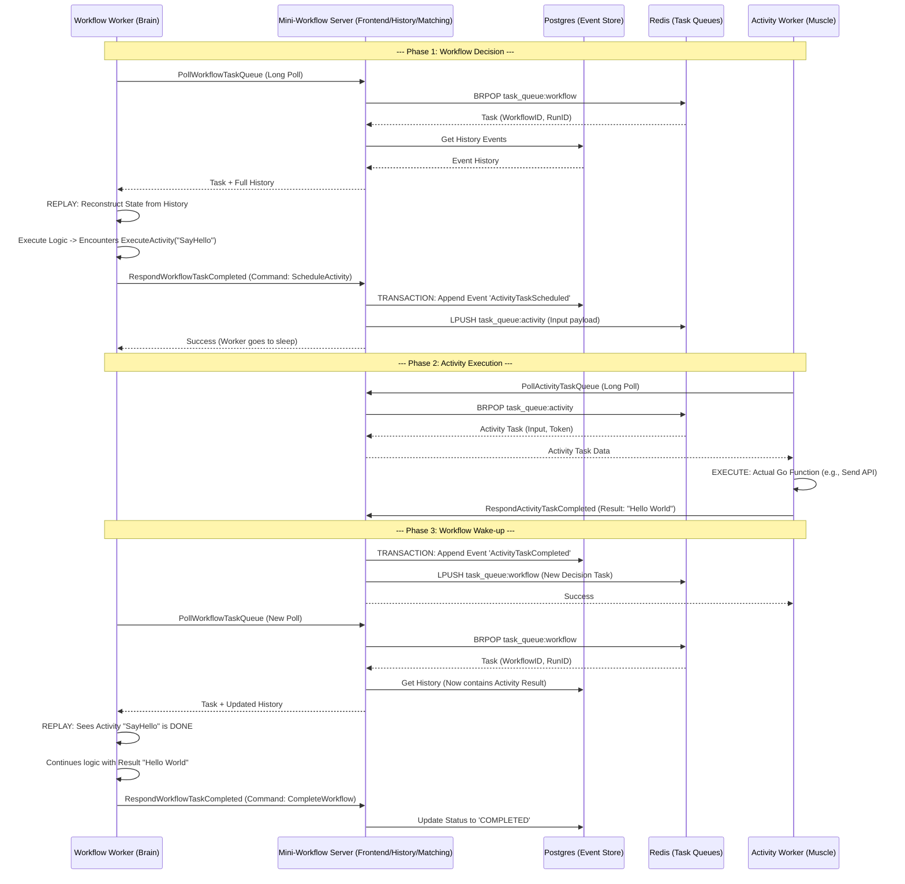
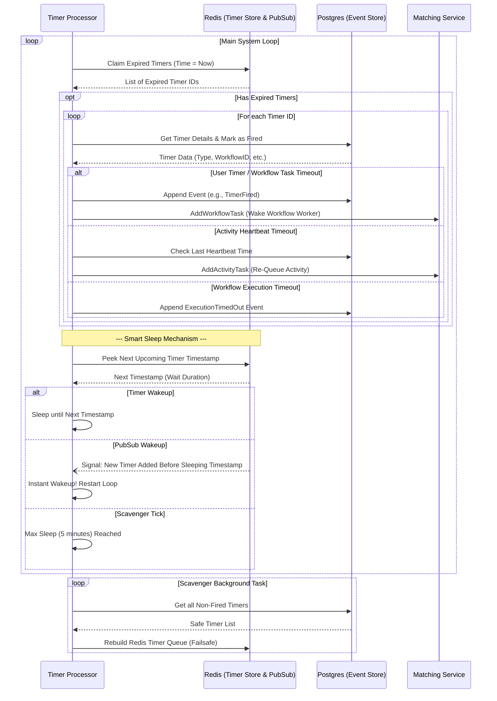

# Mini-Workflow

## Introduction
Mini-Workflow is a lightweight, simplified workflow engine inspired by Temporal. Built entirely in Go, it focuses on the core mechanics of durable execution, event sourcing, and task routing. 

## Motivation
Distributed systems like Temporal are powerful but complex. This project exists as an educational exercise to demystify how a workflow engine actually works under the hood. By building the essential components from scratch—event histories, task queues, and long polling—we can explore the fundamental concepts of durable workflow execution without the overwhelming overhead of a production-grade codebase. The project strictly follows Hexagonal Architecture (Ports and Adapters) to keep domain logic isolated and testable.

## High-Level Architecture
The system is designed as a cluster of independent services that handle workflow state, task routing, and client communication. 

- **Frontend Service**: A gateway that handles all incoming gRPC traffic from clients and workers.
- **History Service**: The source of truth for workflow execution state. It manages the event store and handles state transitions.
- **Matching Service**: Acts as a dispatcher, routing tasks from the History service to the appropriate polling workers via task queues.
- **Timer Processor**: A background component that scans for expired timers and triggers the necessary tasks.



## Codebase Architecture

The project relies on **Hexagonal Architecture** (also known as Ports and Adapters) for all its services. This means the core domain logic is entirely decoupled from external dependencies.

```text
service-name/
├── cmd/                # Entrypoints (e.g., main.go)
├── internal/
│   ├── adapters/       # Implementations of outbound ports (e.g., Database repositories, gRPC clients)
│   ├── ports/          # Interfaces detailing how the core interacts with the outside world
│   └── service/        # Core business and domain logic
```

### Why Hexagonal Architecture?

1. **Testability**: By hiding external systems (like PostgreSQL, Redis, or other RPC frameworks) behind interfaces (`ports`), we can easily generate mocks (using tools like `mockery`) and thoroughly unit-test the core business logic in isolation without spinning up real dependencies.
2. **Decoupling**: The domain logic doesn't need to know how a task is physically enqueued or persisted. It only interacts with an abstract port.
3. **Maintainability**: Changing technical details (e.g., swapping a database engine or changing a transport layer) only requires writing a new adapter. The core domain rules remain untouched.

### In detail flow

1. **Workflow and Activity execution**



2. **Timer Processing and Timeouts**



### Why Smart Sleep is Better and Scalable

The naive approach to handling timers is to run a continuous loop that polls the database or Redis every second (or millisecond) to check for expired timers. While simple, that approach scales horribly and wastes significant CPU cycles and network bandwidth when the system is idle.

The **Smart Sleep Mechanism** solves this elegantly:
1. **Zero Wasted Cycles (Efficiency):** By computing the exact wait duration until the next expected timer (`nextWaitDuration`) and sleeping, we ensure the CPU and Redis are completely idle when there is no work to do.
2. **Instant Responsiveness (Pub/Sub):** If a user schedules a brand new timer that fires *earlier* than the timestamp the worker is currently sleeping for, Redis triggers an immediate Pub/Sub signal. This instantly wakes the processor loop, recalculates the deadline, and grabs the new timer without any latency.
3. **Horizontal Scalability:** Because the system only queries Redis when absolutely necessary (either woken up by a timer or by a Pub/Sub event), you can safely scale out the number of services running the Timer Processor without causing an astronomical spike in I/O polling operations.
4. **Resilience (The Hybrid DB/Redis approach):** We use a hybrid architecture. The timer metadata is durably persisted to PostgreSQL (Event Store), while Redis is used precisely for what it is best at: maintaining an extremely fast in-memory **Sorted Set** for `O(log(N))` chronological lookups. The 5-minute background scavenger job bridges these two worlds. If Redis crashes and loses its in-memory Sorted Set, no data is permanently lost. The Scavenger guarantees that orphaned timers in PostgreSQL are reclaimed and the Redis Sorted Set is rebuilt.

## Scaling Considerations (System Design)

While Mini-Workflow operates efficiently with PostgreSQL and Redis at a small to medium scale, pushing it to millions of operations per second (like a production Temporal cluster) would require evaluating several key bottlenecks:

### 1. The Event Store (History Payload)
* **The Constraint:** Storing every single state transition and workflow payload in a centralized relational database (PostgreSQL) eventually hits write limits.
* **The Solution:** 
  * **Database Sharding:** Partition the database horizontally by `Namespace` or `WorkflowID` to distribute the heavy sequential write load across multiple compute instances.
  * **Distributed NoSQL:** Migrate the event store to an inherently distributed and highly scalable NoSQL database like **Cassandra** (which Temporal uses), specifically optimized for heavy insert workloads.

### 2. Event Replay Saturation
* **The Constraint:** Over time, a long-running workflow accumulates thousands of history events. Every time a worker wakes up (e.g., after an activity completes), it pulls the full history and `REPLAYs` the entire event log to reconstruct its state, wasting CPU and network bandwidth.
* **The Solution:** 
  * **Snapshotting:** Periodically save a snapshot of the worker state to the database. Instead of replaying 10,000 events, the worker pulls the most recent snapshot and replays only the few events that happened afterward.
  * **Sticky Execution (Caching):** Keep the workflow worker instance alive and cache its execution state locally. Only push events to the worker rather than forcing it to pull and rebuild its state from scratch on every step.

### 3. Task Queues and Matching Bottlenecks
* **The Constraint:** Relying entirely on Redis lists for task queues can lead to memory exhaustion and synchronization issues if millions of tasks back up.
* **The Solution:**
  * **Partitioned Queues:** Implement partitioned task routing (e.g., hash the Task Queue name to distribute the queue data and the workers connected to it across a cluster of Matching nodes). 
  * **Database-Backed Queues (Durability):** Ensure tasks are primarily backed in the durable Event Store and only use Redis or Kafka as an ephemeral pub/sub layer or read-heavy cache to notify waiting workers without risking task loss.

### 4. Long Polling Connection Exhaustion
* **The Constraint:** Frontend servers must hold open tens of thousands of idle, long-polling gRPC connections from waiting workers, consuming memory and starving file descriptors.
* **The Solution:**
  * Ensure the Gateway/Frontend layer uses an asynchronous, non-blocking network I/O model (like modern Go networking leveraging `epoll`/`kqueue`), avoiding the overhead of a thread-per-connection.
  * Implement an aggressive Layer 7 load balancing strategy to distribute worker connection weight evenly across the entire fleet of Server clusters.
